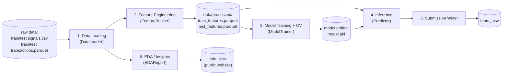
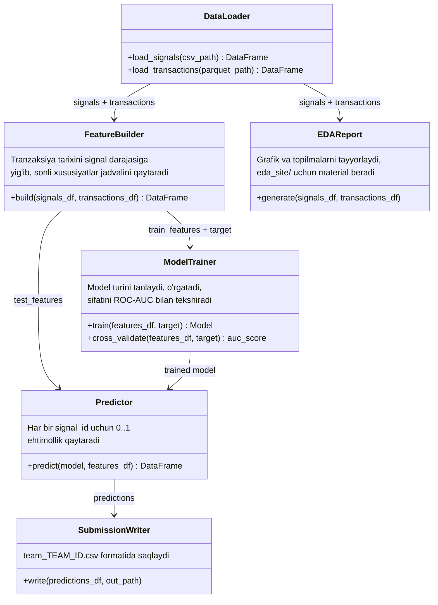

# ARCHITECTURE — AML Signal Escalation Scoring

Bu hujjat loyihaning arxitekturasini **oddiy tilda** tushuntiradi: muammo nima, dastur qanday qismlardan iborat, ma'lumot qaysi bosqichlardan o'tadi va qaysi fayl nimaga javobgar.

---

## 1. Muammo — insoniy tilda

Bank tizimi mijozlarning tranzaksiyalarini kuzatib turadi va shubhali holatlarda avtomatik **signal (alert)** yaratadi — masalan, "bu mijozning oxirgi harakatlari g'alati ko'rinyapti, tekshirib chiqing".

Har bir signalni bank xodimi (specialist) qo'lda ko'rib chiqadi va ikkita qarordan birini qabul qiladi:

- **Dismiss (0)** — signal noto'g'ri chiqqan, muammo yo'q;
- **Escalate (1)** — signal haqiqiy xavf, keyingi tekshiruvga yuboriladi.

**Muammoning sababi:** signallarning katta qismi (~83%) yolg'on chiqadi (dismiss), lekin xodim baribir har birini qo'lda tekshirishga majbur — bu vaqt va resursni behuda sarflaydi, muhim signal navbatda "cho'kib" qolishi mumkin.

**Yechim:** har bir signal uchun "bu escalate bo'lish ehtimoli qancha?" degan savolga 0 dan 1 gacha baho beradigan model qurish. Shunda xodimlar birinchi navbatda eng yuqori ehtimollikdagi signallarni ko'rib chiqadi — bu **triage (navbatlashtirish)** deb ataladi. Modelning sifati **ROC-AUC** metrikasi bilan o'lchanadi.

---

## 2. Ma'lumotlar — ikkita jadval, bir-biriga bog'langan

```
signal_id  ──────────────┐
                          │  (1 signal → ko'p tranzaksiya)
train_signals.csv         train_transactions.parquet
  - signal_id             - signal_id
  - signal_sanasi         - tranzaksiya_vaqti
  - eskalatsiya (target)  - kirim_chiqim (yo'nalish)
                           - tranzaksiya_turi (turi)
                           - miqdor_indeksi (standartlashtirilgan summa)
```

Oddiy qilib aytganda: har bir signalning orqasida o'sha mijozning **o'tmishdagi yuzlab tranzaksiyalari** yotadi (o'rtacha ~500 ta). Model signalning o'zi haqida deyarli hech narsa bilmaydi (faqat sana) — barcha "aql" shu tranzaksiya tarixidan chiqarib olinishi kerak.

Bu — **relyatsion (1-ko'p) ma'lumot**: model ishlatishdan oldin ko'p qatorli tranzaksiya jadvalini bitta signal uchun bitta qatorga "yig'ish" (aggregatsiya) kerak.

---

## 3. Yechim g'oyasi (yuqori darajada)

1. **Feature Engineering (xususiyatlar yasash):** har bir `signal_id` uchun tranzaksiya tarixidan o'nlab sonli xususiyatlar hisoblanadi — masalan: nechta tranzaksiya bo'lgan, o'rtacha summasi qancha, kirim/chiqim nisbati, xalqaro/naqd tranzaksiyalar ulushi, signal sanasidan oldingi 1/7/30 kunlik faollik, va h.k.
2. **Model:** gradient boosting (masalan LightGBM/XGBoost/sklearn GradientBoosting) — bu turdagi "ko'p, lekin har biri zaif signal beruvchi xususiyat" muammosi uchun eng mos yechim, chunki EDA shuni ko'rsatdi: **hech qanday yakka xususiyat kuchli chiziqli bog'liqlik bermaydi** (eng katta korrelyatsiya ~0.06), demak qaror ko'plab xususiyatlarning birgalikdagi (nonlinear) kombinatsiyasiga bog'liq — buni chiziqli model emas, daraxt-asosli ensemble model yaxshi ushlaydi.
3. **Chiqish:** har bir test signali uchun 0..1 oralig'idagi ehtimollik — `team_<TEAM_ID>.csv`.
4. **EDA sayti:** topilmalarni tushunarli grafik va matn bilan ko'rsatuvchi mustaqil veb-sahifa (majburiy topshiriq).

---

## 4. Quvur liniyasi (Pipeline) — bosqichlar



**Nima uchun shunday bo'lingan?** `data/processed/*.parquet` — bu ikki jamoa a'zosi o'rtasidagi **"shartnoma" (contract)**. Feature qismini yozayotgan odam va model qismini yozayotgan odam bir-birini kutmasdan ishlashi uchun, ular faqat shu faylning qanday ustunlardan iborat bo'lishi kerakligini oldindan kelishib olishadi (pastda, bo'lim 6da). Shundan keyin ikkalasi ham parallel ishlay oladi.

---

## 5. Klass diagrammasi (oddiy tilda)

Har bir "klass" — bu bitta aniq vazifani bajaradigan dastur bo'lagi. Ular bir-biriga faqat kirish/chiqish orqali bog'lanadi (ya'ni bittasi ikkinchisining ichki kodini bilishi shart emas).



**Kimga tegishli:**
- `DataLoader`, `FeatureBuilder`, `EDAReport` → **A-shaxs (Data & EDA track)**
- `ModelTrainer`, `Predictor`, `SubmissionWriter` → **B-shaxs (Modeling & Submission track)**

Ikkalasi ham `data/processed/*.parquet` orqali "muloqot qiladi" — kodini emas, faqat shu faylni almashadi.

---

## 6. Xususiyatlar shartnomasi (Feature Contract)

Ikki kishi bir-birini kutmasligi uchun eng muhim narsa — bu **oldindan kelishilgan ustunlar ro'yxati**. `data/processed/train_features.parquet` va `test_features.parquet` quyidagi shaklda bo'ladi:

| ustun | tavsif |
|---|---|
| `signal_id` | kalit (join uchun) |
| `n_txn` | jami tranzaksiyalar soni |
| `amt_mean`, `amt_std`, `amt_max`, `amt_sum` | `miqdor_indeksi` statistikasi |
| `frac_kirim` | kirim ulushi (0..1) |
| `frac_karta`, `frac_bank_otkazmasi`, `frac_naqd`, `frac_xalqaro` | tranzaksiya turi ulushlari |
| `frac_night`, `frac_weekend` | vaqt bo'yicha xususiyatlar |
| `frac_extreme` | \|miqdor_indeksi\| > 2 bo'lgan tranzaksiyalar ulushi |
| `n_txn_1d`, `n_txn_7d`, `n_txn_30d` | signal sanasidan oldingi so'nggi N kundagi faollik |
| `span_days` | birinchi va oxirgi tranzaksiya orasidagi kunlar |
| `velocity` | kuniga o'rtacha tranzaksiya soni |
| `eskalatsiya` | **faqat train faylida** — target |

> Bu jadvalga yangi ustun qo'shish erkin (kelishilgan holda) — lekin yuqoridagi bazaviy ustunlar ismi/turi o'zgarmasligi kerak, chunki B-shaxs shu nomlarga tayangan holda modelni yozadi.

To'liq tafsilotlar va vazifalar bo'linishi uchun [TASKS.md](TASKS.md) ga qarang, umumiy loyihani ishga tushirish uchun [README.md](README.md) ga qarang.
