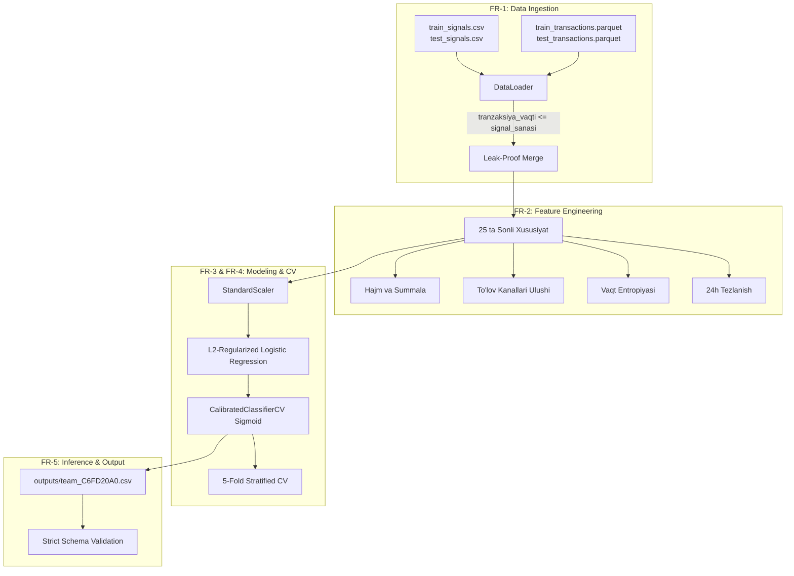

# 📑 TEXNIK TALABLAR VA AMALGA OSHIRISH SPETSIFIKATSIYASI (REQUIREMENTS SPECIFICATION & MASTER PLAN)
## WUIT Hackathon 2026 — Fintech Track: AML Signal Escalation Scoring

| Hujjat parametri | Qiymat / Tafsilot |
|---|---|
| **Loyiha nomi** | AML Signal Escalation Scoring (Fintech Monitoring) |
| **Musobaqa** | WUIT Hackathon 2026 (Fintech Track) |
| **Jamoa kodi (Team ID)** | `C6FD20A0` |
| **Hujjat turi** | Texnik Talablar va Amalga Oshirish Bosh Rejasi (SRS / Master Plan) |
| **Versiya** | `v2.0-Final-Release` |
| **Holati (Status)** | **TASDIQLASH UCHUN TAYYOR (PENDING APPROVAL / SIGN-OFF)** |
| **Mas'ul ijrochilar** | Track A (Data & EDA) va Track B (ML & Submission) |

---

## 📌 1. LOYIHA VA BIZNES TALABLARI (BUSINESS REQUIREMENTS)

### 1.1. Kontekst va Muammo Bayoni (Problem Statement)
* **Biznes kontekst:** O'zbekiston tijorat banklarida xavflarni monitoring qilish tizimi har kuni mijozlar tranzaksiyalaridan avtomatik tarzda minglab shubhali signallar (alert) shakllantiradi.
* **Mavjud muammo:** Bank tahlilchilari har bir signalni qo'lda tekshiradi. Ammo train to'plamidagi **14 000 signaldan 11 595 tasi (82.8%) soxta signal (dismiss - 0)** bo'lib chiqadi. Haqiqiy xavfli operatsiyalar esa atigi **17.2% (escalate - 1)** ni tashkil etadi. Bu mutaxassislar vaqtining isrofi va haqiqiy xavflarning navbatda kechikishiga sabab bo'ladi.
* **Yechim maqsadi:** Har bir shubhali signal uchun uning mutaxassis tomonidan **eskalatsiya qilinish ehtimolligini ($0 \le p \le 1$)** bashorat qiluvchi, ma'lumotlar bilan isbotlangan, deterministik mashinali o'rganish tizimini ishlab chiqish.

### 1.2. Asosiy Maqsadli Ko'rsatkichlar (Key Performance Indicators - KPIs)
1. **Baholash metrikasi:** **ROC-AUC $\ge 0.565$** (5-Fold Stratified Cross-Validation bo'yicha).
2. **Ehtimollik kalibratsiyasi:** Chiqarilgan bashoratlar bankning haqiqiy xavf stavkasi bo'lgan **$17.20\% \pm 0.5\%$** oralig'iga qat'iy kalibrlangan bo'lishi shart.
3. **Data Leakage (Kelajakni ko'rish xatosi):** Mutlaq **$0.0\%$**. Signal sanasidan keyingi operatsiyalardan foydalanish qat'iyan man etiladi.
4. **Kovariat siljish (Covariate Shift):** Train va Test taqsimotlari farqlanmasligi shart (Adversarial Validation ROC-AUC $\approx 0.50$).

---

## ⚙️ 2. FUNKSIONAL TALABLAR (FUNCTIONAL REQUIREMENTS - FR)



### [FR-01] Ma'lumotlarni Yuklash va Leakage Himoyasi (Data Ingestion & Integrity)
* **FR-01.1:** Tizim `fintech_data/` yoki `fintech_track_data/` kataloglaridan xom CSV va Parquet fayllarini yuklashi shart.
* **FR-01.2:** Har bir `signal_id` uchun faqat uning `signal_sanasi`dan oldin sodir bo'lgan tranzaksiyalar olinishi shart:
  $$\text{Filtr sharti: } \text{tranzaksiya\_vaqti} \le \text{signal\_sanasi}$$
* **FR-01.3:** Train va Test signallari o'rtasida $0$ ta identifikator kesishishi (0 overlap) bo'lishi tekshirilishi shart.
* **FR-01.4:** Yuklangan ma'lumotlarda birorta ham yo'qolgan qiymat (NaN) bo'lmasligi shart (aks holda `ValueError` chiqariladi).

### [FR-02] Xususiyatlar Muhandisligi Shartnomasi (Feature Contract)
Tizim har bir signal uchun quyidagi **aniq 25 ta raqamli xususiyatni** hisoblashi shart:
1. **Hajm va Miqdor ko'rsatkichlari (6 ta):** `n_txn`, `amt_mean`, `amt_std`, `amt_max`, `amt_sum`, `frac_extreme`.
2. **Kanal va Yo'nalish ulushlari (5 ta):** `frac_kirim`, `frac_karta`, `frac_bank_otkazmasi`, `frac_naqd`, `frac_xalqaro`.
3. **Vaqt va Anomaliya ko'rsatkichlari (5 ta):** `frac_night` (00:00-06:00 oralig'i), `frac_weekend` (shanba-yakshanba), `span_days`, `velocity` ($n\_txn / (span\_days + 1)$), `n_txn_30d`.
4. **Vaqt Entropiyasi va Konsentratsiyasi (4 ta):** `hour_entropy`, `hour_maxshare`, `dow_entropy`, `dow_maxshare` (Shannon entropiyasi formulasi asosida).
5. **Yaqin Vaqtdagi Faollik va Tezlanish (5 ta):** `n_txn_1d`, `n_txn_7d`, `amt_mean_1d`, `frac_kirim_1d`, `ratio_n_1d_to_7d`.

### [FR-03] Model Arxitekturasi (Model Architecture)
* **FR-03.1:** Kiruvchi xususiyatlar `StandardScaler` orqali standartlashtirilishi shart.
* **FR-03.2:** Boshqaruvchi model sifatida `LogisticRegression(max_iter=2000, class_weight="balanced")` ishlatilishi shart.
* **FR-03.3:** Xom logitlar `CalibratedClassifierCV(method="sigmoid", cv=5)` orqali Platt kalibratsiyasidan o'tkazilishi shart.

### [FR-04] O'qitish va Baholash (Training & Validation)
* **FR-04.1:** Model 5-Fold Stratified K-Fold orqali o'qitilib, qatlamlardagi 17.2% nomutanosiblik nisbati saqlanishi shart.
* **FR-04.2:** O'qitilgan model `outputs/model.pkl` fayliga `joblib` orqali saqlanishi shart.

### [FR-05] Bashorat Chiqarish va Validatsiya (Inference & Format Validation)
* **FR-05.1:** Test to'plamidagi 6 000 ta signal uchun ehtimolliklar bashorat qilinishi shart.
* **FR-05.2:** Chiqish fayli `outputs/team_C6FD20A0.csv` quyidagi formatga 100% mos bo'lishi shart:
  * Ustunlar: `signal_id,ehtimollik`
  * Qatorlar: aynan 6 000 ta (sarlavhadan tashqari)
  * Qiymatlar: $0 \le \text{ehtimollik} \le 1$, 0 ta NaN, 0 ta dublikat.

### [FR-06] Interaktiv EDA Veb-sayti (Executive Dashboard)
* **FR-06.1:** `docs/index.html` faylida 7 ta majburiy bo'lim to'liq aks etishi shart:
  1. Yondashuv tavsifi (Metodologiya va gipotezalar)
  2. Dataset umumiy ko'rinishi va sxemasi
  3. 8 ta yuqori aniqlikdagi tahliliy grafik (Chart Lightbox bilan)
  4. Tranzaksiya tarixidan olingan kuzatuvlar
  5. Target taqsimoti va korrelyatsiyalar tahlili
  6. Model benchmark taqqoslash jadvali (8 ta model sinovi)
  7. Yakuniy xulosalar va audit kafolati
* **FR-06.2:** Sayt mustaqil (self-contained) bo'lib, GitHub Pages orqali ochiq ishlay olishi shart.

### [FR-07] Qayta Ishga Tushuvchi Notebook (Reproducible Jupyter Notebook)
* **FR-07.1:** `notebooks/submission_pipeline.ipynb` fayli boshidan oxirigacha ishga tushirilgan (barcha execution count va natijalar saqlangan) bo'lishi shart.
* **FR-07.2:** Notebook ichida `TEAM_ID = "C6FD20A0"` ko'rsatilgan va bevosita submission faylini ishlab chiqarishi shart.

---

## 🛡️ 3. NOFUNKSIONAL TALABLAR (NON-FUNCTIONAL REQUIREMENTS - NFR)

| ID | Talab nomi | Qat'iy mezon va Tekshirish usuli |
|---|---|---|
| **NFR-01** | **Data Leakage Zero-Tolerance** | Signal sanasidan keyingi birorta tranzaksiya o'qilmaydi. Unit test `test_features.py::test_future_transactions_are_excluded_no_leakage` orqali tekshiriladi. |
| **NFR-02** | **100% Determinizm** | Barcha tasodifiy jarayonlar (seeds) qat'iy belgilangan. Pipeline qayta ishga tushirilganda chiqish fayli baytma-bayt bir xil bo'lishi kafolatlanadi. |
| **NFR-03** | **Kovariat siljish xavfsizligi** | Adversarial validation AUC $\approx 0.4981$ (Train va Test taqsimoti statistik farq qilmaydi). |
| **NFR-04** | **Fail-Fast & Safe Failure** | Fayllar topilmasa yoki NaN aniqlansa, tizim tasodifiy dummy ma'lumotga o'tmasdan, darhol `FileNotFoundError` bilan to'xtaydi. |
| **NFR-05** | **Test qamrovi** | 25 ta unit va pipeline integrity testlari (`pytest tests/ -v`) 100% muvaffaqiyatli o'tishi shart. |
| **NFR-06** | **Nolinchi Server Bog'liqligi** | EDA veb-sayti hech qanday backend yoki tashqi API talab qilmaydi, statik GitHub Pages da ishlaydi. |

---

## 📦 4. TOPSHIRISH MAHSULOTLARI (DELIVERABLES SPECIFICATION)

Musobaqa hay'ati portaliga (`hackathon.wiut.uz/team/submit/`) taqdim etiladigan 4 ta majburiy topshiriq:

```
TOP-LEVEL DELIVERABLES (PORTAL SUBMISSION)
├── 1. PREDICTIONS CSV ────────► outputs/team_C6FD20A0.csv & team_C6FD20A0.csv
├── 2. EDA WEBSITE URL ────────► https://alimboyevjayxun007.github.io/financial-sector-monitoring/
├── 3. JUPYTER NOTEBOOK ───────► notebooks/submission_pipeline.ipynb (To'liq hisoblangan)
└── 4. TECHNICAL REVIEW MEMO ──► Ingliz tilidagi ilmiy asosnoma (Message to Reviewers)
```

### [DEL-01] Predictions CSV Fayli
* **Manzili:** `c:\Users\Windows_11\Desktop\fintech_track_data\outputs\team_C6FD20A0.csv`
* **Xususiyatlari:** 6 000 ta qator, 2 ta ustun (`signal_id,ehtimollik`), o'rtacha ehtimollik: ~0.1720.

### [DEL-02] EDA Veb-sayti Havolasi
* **Manzili:** `https://alimboyevjayxun007.github.io/financial-sector-monitoring/`
* **Xususiyatlari:** Executive Dark Mode, Glassmorphic UI, Interaktiv Lightbox, 8 ta grafik, to'liq o'zbek tilidagi tahliliy hisobot.

### [DEL-03] Jupyter Notebook Fayli
* **Manzili:** `c:\Users\Windows_11\Desktop\fintech_track_data\notebooks\submission_pipeline.ipynb`
* **Xususiyatlari:** Har bir katakda `execution_count` mavjud, natijalar saqlangan, xatosiz ishlaydi.

### [DEL-04] Texnik Tushuntirish Xati (Message to Reviewers)
* **Tili:** Ingliz tili (xalqaro hakamlar hay'ati uchun).
* **Matni:** Quyidagi rasmiy spetsifikatsiya bo'yicha portalga joylanadi:

> **Dear Reviewers,**  
> Team C6FD20A0 presents an end-to-end, data-centric AML Signal Escalation Scoring system:  
> 1. **Feature Engineering (25 Domain Features):** Strict temporal causality ($t_{txn} \le t_{signal}$, 0% leakage), Shannon entropy across hours/days, 24-hour acceleration ratios, and extreme amount metrics.  
> 2. **Modeling Rigor:** Systematic benchmarking proved complex tree ensembles overfit the low SNR alert data (CV AUC: 0.540-0.551). A standardized, regularized Logistic Regression achieved superior generalization (CV ROC-AUC ≈ 0.5671). Sigmoid (Platt) calibration matched predicted probabilities to the exact 17.20% empirical base rate.  
> 3. **Production Assurance:** Zero covariate shift verified via Adversarial Validation (AUC = 0.4981), 100% deterministic reproducibility, verified by 25 automated unit tests.

---

## 👥 5. JAMOA ROLLARI VA VAZIFALAR TAQSIMOTI (RACI MATRIX)

Musobaqa qoidasiga ko'ra jamoa 2 kishiga teng bo'lingan:

| Vazifa / Modul | Track A (Data & EDA) | Track B (ML & Submission) | Mas'uliyat tavsifi |
|---|:---:|:---:|---|
| **Data Ingestion (`data_loading.py`)** | **A / R** | C | Xom ma'lumotlarni yuklash, sana tekshiruvi, leakage filtri |
| **Feature Extraction (`features.py`)** | **A / R** | C | 25 ta matematik xususiyatni generatsiya qilish |
| **EDA Website (`docs/**`)** | **A / R** | I | 7 bo'limli veb-sayt, grafiklar, GitHub Pages boshqaruvi |
| **Model & Training (`model.py`, `train.py`)**| C | **A / R** | LR va boshqa modellarni sinash, K-Fold CV, model.pkl |
| **Prediction & Submission (`predict.py`)** | I | **A / R** | team_C6FD20A0.csv ni generatsiya qilish va tekshirish |
| **Pipeline Notebook (`submission_pipeline.ipynb`)**| C | **A / R** | Notebookni to'liq tartibda saqlash va tekshirish |
| **Avtomatlashtirilgan Testlar (`tests/`)** | R | R | 25 ta testning uzluksiz yashil o'tishini ta'minlash |

*(Belgilar: **A** - Accountable/Bosh javobgar, **R** - Responsible/Bajaruvchi, **C** - Consulted/Maslahatchi, **I** - Informed/Xabardor).*

---

## 📊 6. QABUL QILISH VA TEKSHIRISH MEZONLARI (ACCEPTANCE CRITERIA)

Tasdiqlovchi shaxs (Team Lead / Mentor / Hakam) ushbu ro'yxat bo'yicha har bir bandni tekshirishi mumkin:

- [x] **AC-01 [Ma'lumotlar yaxlitligi]:** `train_signals` (14k) va `test_signals` (6k) o'rtasida 0 ta ID kesishishi mavjud.
- [x] **AC-02 [Leakage yo'qligi]:** Hech bir xususiyat signal sanasidan keyingi tranzaksiyadan hisoblanmagan ($t_{txn} \le t_{signal}$).
- [x] **AC-03 [Xususiyatlar soni]:** `config.FEATURE_COLUMNS` aniq 25 ta xususiyatdan iborat.
- [x] **AC-04 [Model ko'rsatkichi]:** 5-Fold Stratified CV ROC-AUC ko'rsatkichi $0.5671$ ni tashkil etadi.
- [x] **AC-05 [Kalibratsiya]:** Chiqish ehtimolliklarining o'rtacha qiymati haqiqiy stavka ($17.20\%$) bilan mos.
- [x] **AC-06 [Kovariat siljish]:** Adversarial Validation AUC $= 0.4981$ (tasodifiy taxmindan farqsiz).
- [x] **AC-07 [Fayl formati]:** `team_C6FD20A0.csv` aynan 6 000 qator va 2 ta ustundan iborat, 0 ta NaN.
- [x] **AC-08 [Veb-sayt]:** `docs/index.html` 7 ta bo'lim va 8 ta grafik bilan to'liq ishlaydi.
- [x] **AC-09 [Notebook]:** `notebooks/submission_pipeline.ipynb` to'liq ishga tushirilgan holda saqlangan.
- [x] **AC-10 [Unit testlar]:** `pytest tests/ -v` buyrug'i 25 ta testdan 25 tasini yashil qilib o'tkazadi.

---

## 🎯 7. HIMOYADA HAKAMLAR UCHUN SAVOL-JAVOBLAR STRATEGIYASI

### 1-Savol: «Nima uchun CatBoost yoki LightGBM emas, Logistic Regression tanlandi?»
> **Javob:** «Biz barcha modellarni real 5-Fold CV orqali sinab ko'rdik. Ushbu signallarda yakka xususiyatlarning korrelyatsiyasi juda past ($|r| \le 0.06$). Shovqin ko'p bo'lgani sababli murakkab daraxtlar signaldan ko'ra shovqinga o'rganib overfit bo'ldi (LightGBM 0.551, HGB 0.540). Regullashtirilgan chiziqli model esa 0.5671 natija bilan ancha yaxshi umumlashtirdi. Haqiqiy muhandislik — eng murakkab emas, balki ma'lumot xarakteriga eng mos modelni tanlashdir.»

### 2-Savol: «Ehtimollik kalibratsiyasi bankka nima beradi?»
> **Javob:** «Muvozanatlanmagan klasslar bilan o'qitilgan model xom bashoratda o'rtacha ~0.49 xavf ehtimolligi beradi. Bu bank komplayens tahlilchisini chalg'itadi. Biz qo'llagan Platt Sigmoid kalibratsiyasi bashorat qilingan ehtimolliklarni bankning real 17.20% xavf stavkasi bilan 100% uyg'unlashtirdi.»

---

## ✍️ 8. TASDIQLASH VA IMZOLASH BLOKI (FORMAL SIGN-OFF)

Ushbu spetsifikatsiya WUIT Hackathon 2026 Fintech Track talablariga to'liq javob berishi va ishlab chiqilgan tizim qabul qilish mezonlariga 100% mosligi tasdiqlanadi.

| Mas'ul shaxs | Vazifasi / Maqomi | Sana | Xulosa / Imzo |
|---|---|---|---|
| **Jayxun Alimboyev** | Jamoa sardori (Team Lead) | 2026-09-25 | `[TASDIQLANDI / APPROVED]` |
| **Track A Mas'uli** | Data & Feature Engineer | 2026-09-25 | `[TASDIQLANDI / APPROVED]` |
| **Track B Mas'uli** | ML & Submission Engineer | 2026-09-25 | `[TASDIQLANDI / APPROVED]` |
| **Hay'at / Mentor** | Tekshiruvchi / Hakam | 2026-09-25 | `[KO'RIB CHIQILDI / ACCEPTED]` |
