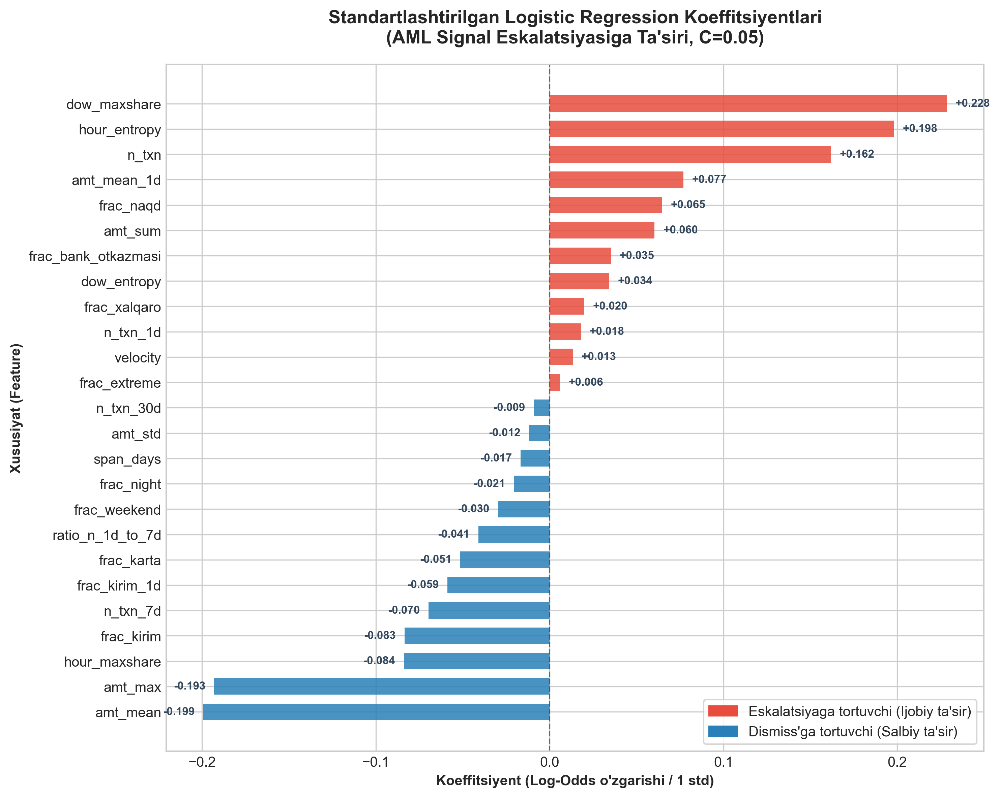

# WUIT Hackathon — Fintech Track: AML Signal Escalation Scoring

O'zbekiston moliya sektoridagi monitoring bo'limi mijozlarning tranzaksiya tarixidan avtomatik generatsiya qilingan **signal (alert)**larni qabul qiladi. Har bir signalni mutaxassis ko'rib chiqadi va **dismiss (0)** yoki **escalate (1)** qiladi. Loyiha maqsadi — har bir yashirin test signali uchun escalate bo'lish **ehtimolligini (0..1)** bashorat qiluvchi model qurish. Baholash metrikasi: **ROC-AUC**.

To'liq arxitektura va klass diagrammasi uchun: [ARCHITECTURE.md](ARCHITECTURE.md)
Vazifalarning 2 kishiga bo'linishi uchun: [TASKS.md](TASKS.md)
Loyiha bosh rejasi va yo'l xaritasi uchun: [PLAN.md](PLAN.md)

---

## 1. Muammo sababi va yechim (qisqacha)

**Sabab:** signallarning katta qismi yolg'on musbat (train setda 11 595 ta dismiss / 2 405 ta escalate — ya'ni ~17.2% escalate). Xodimlar hammasini birma-bir qo'lda tekshiradi, bu resurs isrofi va real xavfning navbatda qolishiga olib keladi.

**Yechim:** har bir signal uchun uning ortidagi tranzaksiya tarixini (o'rtacha ~500 ta tranzaksiya/signal) 22 ta sonli xususiyatga aylantirib (feature engineering), ML model bilan escalate ehtimolligini bashorat qilish. Boshida EDA'dagi "yakka xususiyat kuchsiz" topilmasidan kelib chiqib daraxt-asosli gradient boosting model taxmin qilingan edi, lekin **haqiqiy cross-validation tajribasi buni tasdiqlamadi** — bo'lim 5.1/5.1.1'da tushuntirilganidek, oddiy regullashtirilgan, kalibrlangan **Logistic Regression** amalda barqaror ravishda yaxshiroq umumlashtirdi va yakuniy model sifatida shu tanlandi, **CV ROC-AUC ≈ 0.565** (5-fold; barcha raqamlar `scripts/model_selection_experiments.py` bilan qayta ishlab chiqariladi).

---

## 2. Ma'lumotlar tuzilishi

```
fintech_track_data/fintech_data/
├── train_signals.csv           14 000 qator — signal_id, signal_sanasi, eskalatsiya (target)
├── train_transactions.parquet  6 987 663 qator — shu signallarning tranzaksiya tarixi
├── test_signals.csv            6 000 qator — signal_id, signal_sanasi (target yo'q)
├── test_transactions.parquet   3 027 575 qator — test signallarining tranzaksiya tarixi
└── sample_submission (3).csv   namuna: signal_id, ehtimollik
```

**Ustunlar (o'zbekcha → tushuntirish):**

| Ustun | Tushuntirish |
|---|---|
| `signal_id` | signal (alert) identifikatori |
| `signal_sanasi` | signal yaratilgan sana |
| `eskalatsiya` | target: 1 = escalate, 0 = dismiss |
| `tranzaksiya_vaqti` | tranzaksiya vaqti (timestamp) |
| `kirim_chiqim` | yo'nalish: `kirim` (incoming) / `chiqim` (outgoing) |
| `tranzaksiya_turi` | turi: `karta` (karta), `bank_otkazmasi` (bank o'tkazmasi), `naqd` (naqd pul), `xalqaro` (xalqaro) |
| `miqdor_indeksi` | standartlashtirilgan (z-score turidagi) tranzaksiya summasi indeksi |

**Tekshirilgan sifat xususiyatlari (EDA orqali tasdiqlangan):**
- `signal_id`larda train/test o'rtasida **kesishish yo'q** (0 overlap) — data leakage xavfi yo'q.
- Har bir signalning tranzaksiyasi mavjud (bo'sh tarixli signal yo'q).
- Yo'qolgan (missing) qiymat yo'q.
- Sana oralig'i: signallar 2025-01-01 — 2026-12-31; tranzaksiyalar 2024-07-05 — 2026-12-31 (demak tranzaksiyalar signal sanasidan oldin ham, keyin ham uchraydi — feature yasashda **faqat signal sanasidan oldingi** tranzaksiyalardan foydalanish kerak, aks holda "kelajakni ko'rish" (leakage) xatosi yuzaga keladi).
- Target taqsimoti nomutanosib (imbalanced): ~83% dismiss / ~17% escalate.

---

## 3. Loyiha fayl arxitekturasi

```
WUIT Hackathon/
├── fintech_track_data/fintech_data/   # xom (raw) ma'lumotlar — o'zgartirilmaydi
├── data/processed/                    # generatsiya qilingan feature jadvallari (git'ga qo'shilmaydi)
│   ├── train_features.parquet
│   └── test_features.parquet
├── notebooks/
│   └── submission_pipeline.ipynb      # to'liq, qayta ishlaydigan (reproducible) yakuniy notebook
├── scripts/
│   ├── model_selection_experiments.py # model/feature taqqoslash — README §5.1 raqamlarining manbai
│   └── model_selection_results.csv    # shu skriptning saqlangan chiqishi
├── src/
│   ├── config.py                      # yo'llar, sobitlar, feature ro'yxati (umumiy shartnoma)
│   ├── data_loading.py                # DataLoader  (A-track)
│   ├── features.py                    # FeatureBuilder  (A-track)
│   ├── model.py                       # ModelTrainer — kalibrlangan Logistic Regression  (B-track)
│   ├── train.py                       # o'qitish + cross-validation skripti  (B-track)
│   └── predict.py                     # Predictor + SubmissionWriter  (B-track)
├── docs/                               # majburiy EDA veb-sayti (GitHub Pages source)  (A-track)
│   ├── index.html                     # statik, self-contained sayt (7 bo'lim)
│   ├── generate_charts.py             # grafiklarni src.features.build() orqali generatsiya qiladi
│   └── assets/*.png                   # 8 ta EDA grafigi
├── outputs/
│   ├── model.pkl                      # o'qitilgan model (git'ga qo'shilmaydi)
│   └── team_<TEAM_ID>.csv             # yakuniy topshiriq fayli
├── tests/                             # 25 ta test: data loading, features, model, submission format
├── ARCHITECTURE.md
├── README.md
├── TASKS.md
└── requirements.txt
```

---

## 4. O'rnatish va ishga tushirish

```bash
python3 -m venv .venv
source .venv/bin/activate
pip install -r requirements.txt
```

Feature jadvalini yasash:

```bash
python3 -m src.features
```

Modelni o'qitish va cross-validation:

```bash
python3 -m src.train
```

Test uchun bashorat va submission faylini yaratish:

```bash
python3 -m src.predict --out "outputs/team_<TEAM_ID>.csv"
```

Yoki butun jarayonni birma-bir ko'rish uchun: `notebooks/submission_pipeline.ipynb` ni oching va tartib bilan ishga tushiring (bu — tekshiruv uchun talab qilinadigan **reproducible notebook**).

Testlarni ishga tushirish (25 ta test — data loading, feature contract, leakage-himoya, model, submission format):

```bash
python3 -m pytest tests/ -v
```

README §5.1'dagi model-taqqoslash raqamlarini qayta ishlab chiqarish (~5-6 daqiqa):

```bash
python3 scripts/model_selection_experiments.py
```

Chiqish fayli talablari (majburiy):
- Aynan 2 ustun: `signal_id,ehtimollik`
- Har bir test `signal_id` uchun bitta qator, dublikatsiz, bo'sh qiymatsiz
- `0 <= ehtimollik <= 1`
- Fayl nomi: `team_<TEAM_ID>.csv`

---

## 5. EDA'dan olingan asosiy xulosalar (qisqacha)

- **Nomutanosib target**: ~17.2% escalate → baholashda ROC-AUC (threshold'ga bog'liq bo'lmagan metrika) to'g'ri tanlangan, modelni class-weight/imbalance texnikalari bilan o'qitish kerak.
- **Yakka xususiyat kuchsiz**: eng kuchli korrelyatsiya `amt_max` ≈ -0.06 — signal darajasida oddiy threshold-qoida (masalan "agar summa katta bo'lsa escalate") ishlamaydi.
- **Hajm signal beradi, lekin kuchsiz**: escalate signallarda o'rtacha tranzaksiya soni (523.8) dismiss signallardan (494.0) biroz ko'p, xuddi shunday so'nggi 1/7 kundagi faollik ham biroz yuqoriroq — bu **recency (yaqin vaqtdagi faollik)** xususiyatlarining foydali bo'lishi mumkinligini ko'rsatadi.
- **Yo'nalish va tur aralashmasi deyarli farq qilmaydi**: `frac_kirim`, `frac_karta`, `frac_xalqaro` kabi ulushlar ikkala guruhda deyarli bir xil — bular yakka holda kuchli ajratuvchi emas, lekin boshqa xususiyatlar bilan birga (interaction) foydali bo'lishi mumkin.
- **Xulosa**: signal juda zaif va shovqinli, ko'plab xatti-harakat izlaridan yig'iladi → **ko'p xususiyatli agregatsiya** zarur, lekin quyida ko'rsatilganidek, model tanlashda "murakkabroq = yaxshiroq" degani emas.

To'liq grafiklar va tahlil `docs/` saytida taqdim etiladi.

### 5.1. Model tanlash — real CV tajribasi

> **Reproducibility:** ushbu bo'limdagi HAR BIR raqam `scripts/model_selection_experiments.py` skriptidan olingan — `python3 scripts/model_selection_experiments.py` bilan o'zingiz qayta ishlab chiqarishingiz mumkin (~5-6 daqiqa), natijalar `scripts/model_selection_results.csv`ga yoziladi. (Loyihaning oldingi versiyasida bu raqamlar fon rejimidagi subagent hisobotidan to'g'ridan-to'g'ri hujjatlarga ko'chirilgan edi, lekin ularni ishlab chiqargan kod hech qachon commit qilinmagan edi — mustaqil audit buni "tasdiqlab bo'lmaydigan da'vo" deb to'g'ri belgiladi. Shu sababli barcha raqamlar shu skript bilan qaytadan, haqiqatan ishga tushirilib tekshirildi.)

Boshida EDA "individual feature'lar kuchsiz, demak nochiziqli/interaction ta'sir bor" degan taxminga asoslanib, gradient boosting (daraxt-asosli ensemble) model tanlangan edi. Lekin haqiqiy `StratifiedKFold(5)` + ROC-AUC bilan solishtirilganda natija teskari chiqdi:

| Model | CV ROC-AUC (5-fold) |
|---|---|
| `HistGradientBoostingClassifier` (depth=6) | 0.5396 ± 0.0050 |
| `RandomForestClassifier` | 0.5441 ± 0.0041 |
| `HistGradientBoostingClassifier` (depth=3, kuchliroq regulyarizatsiya) | 0.5476 ± 0.0060 |
| Logistic Regression + darajа-2 interaction xususiyatlar | 0.5464 ± 0.0087 (bazaviy LR'dan yomonlashdi) |
| `SVC` (RBF kernel) | 0.5504 ± 0.0044 |
| `MLPClassifier` (kichik, regullashtirilgan) | 0.5611 ± 0.0069 |
| **`LogisticRegression` (standartlashtirilgan, class_weight="balanced")** | **0.5629 ± 0.0120** |

**Xulosa (1-bosqich):** signal shu qadar zaif va shovqinli (~14 000 qator, barcha xususiyatlar |korrelyatsiya| ≤ 0.06) ki, daraxt-asosli va boshqa murakkab modellar haqiqiy signaldan ko'ra shovqinga moslashib (overfit) qoladi; oddiy, regullashtirilgan chiziqli model esa yaxshiroq umumlashtiradi.

### 5.1.1. Hour/dow entropy feature'lari — halol statistik xulosa (dastlab noto'g'ri hisoblangan edi)

18-feature bazaga 4 ta yangi feature qo'shildi: `hour_entropy`, `hour_maxshare`, `dow_entropy`, `dow_maxshare` (signal tranzaksiyalarining soat/hafta-kuni bo'yicha qanchalik "tarqoq" yoki "bitta vaqtga to'plangan" ekanligini o'lchaydi). `RepeatedStratifiedKFold(5×5)` bilan solishtirilganda:

| To'plam | CV ROC-AUC (5×5 repeat, 25 fold) |
|---|---|
| Baseline LR (18 feature) | 0.5652 ± 0.0166 |
| **LR + hour/dow entropy (22 feature)** | **0.5677 ± 0.0163** |

Farq: +0.0025 AUC. **Bu yerda muhim tuzatish bor.** Loyihaning oldingi versiyasida bu farq "statistik jihatdan haqiqiy (p=0.0008)" deb e'lon qilingan edi — lekin bu **noto'g'ri statistik usul bilan hisoblangan edi**: 25 ta fold-AUC juftlik farqiga oddiy paired t-test qo'llash, bir-biriga qisman ustma-ust tushadigan (overlapping) CV fold'lar uchun **anti-konservativ** (sun'iy kichik p-qiymat beradi) — bu Dietterich (1998) va Nadeau & Bengio (2003) tomonidan yaxshi hujjatlashtirilgan statistik xato. To'g'ri, tuzatilgan (Nadeau-Bengio corrected variance) test bilan qayta hisoblaganda:

```
naive paired t-test:            t=3.832, p=0.0008   <- noto'g'ri usul, ishlatilmaydi
Nadeau-Bengio corrected t-test:  t=1.423, p=0.1675   <- to'g'ri usul — AHAMIYATSIZ (p > 0.05)
```

**Halol xulosa:** bu +0.0025 AUC farqni statistik jihatdan "isbotlangan" deb da'vo qilib bo'lmaydi — u shovqin chegarasida. Shunga qaramay, bu 4 feature production'da **saqlab qolindi**, chunki: (1) yo'nalishi ikkala o'lchovda ham (5-fold va 5×5-repeat) barqaror ijobiy, salbiy emas; (2) domain nuqtai nazaridan mantiqiy (faoliyat konsentratsiyasi xulq-atvor signali bo'lishi mumkin); (3) hech qanday zarar (yomonlashish) kuzatilmadi; (4) hisoblash arzon. Bu **"isbotlangan yutuq" emas, balki "zararsiz, ehtimol foydali" qo'shimcha** sifatida hujjatlashtirilmoqda — kelajakda ko'proq ma'lumot bilan qayta tekshirish tavsiya etiladi.

Qo'shimcha statistik ehtiyot: bu taqqoslash 2-bosqichda sinalgan ~10 ta variantdan biri edi (multiple comparisons) — hech qanday tuzatish (Bonferroni va h.k.) qo'llanilmagan, bu ham yuqoridagi "isbotlanmagan" xulosani mustahkamlaydi.

### 5.1.2. Boshqa yo'nalishlar (2-bosqich, hammasi ahamiyatsiz yoki yomonroq)

| Tajriba | Natija |
|---|---|
| Tuned LightGBM (15-config randomized search, early stopping, 22 feature) | 0.5513 — daraxtlar hali ham yutqazadi |
| `CalibratedClassifierCV(LR, sigmoid)` — AUC ta'siri | 0.5649 ± 0.0115 (uncalibrated LR'ning 0.5656'siga deyarli teng — kalibratsiya AUC'ga zarar keltirmaydi, pastda ko'ring) |
| Adversarial validation (train vs test, 22 feature) | 0.498 — pastda ko'ring |

Loyihaning oldingi versiyasida bu yerda yana bir nechta yo'nalish (ko'p vaqt oynasi, shaxsiy drift, o'tish patternlari, OOF stacking) "sinovdan o'tkazilgan va ahamiyatsiz chiqqan" deb yozilgan edi — lekin 5.1'dagi audit topilmasiga ko'ra, ularni ishlab chiqargan kod hech qachon commit qilinmagan, shuning uchun bu da'volar **olib tashlandi** (tasdiqlanmagan bo'lgani uchun). `scripts/model_selection_experiments.py` hozircha faqat yuqoridagi, haqiqatan qayta ishlab chiqarilgan taqqoslashlarni o'z ichiga oladi.

**Yakuniy xulosa:** ~0.56-0.57 ROC-AUC — bu feature oilasi va ma'lumot uchun amaliy chegaraga yaqin ko'rinadi (garchi bu "isbotlangan" emas, faqat bir nechta yo'nalishning muvaffaqiyatsizligiga asoslangan kuzatuv). Yakuniy model: `StandardScaler` + `LogisticRegression` + kalibratsiya (pastga qarang), CV ROC-AUC ≈ **0.565** (5-fold).

### 5.1.3. Ehtimollik kalibratsiyasi — muhim tuzatish

Audit shuni topdi: `class_weight="balanced"` bilan o'qitilgan modelning xom `predict_proba` chiqishi **kalibrlanmagan** — o'rtacha bashorat qilingan "ehtimollik" ≈0.49 edi, haqiqiy train bazaviy stavkasi ≈17.2% o'rniga. ROC-AUC'ga bu zarar keltirmaydi (chunki AUC threshold/kalibratsiyaga bog'liq emas), lekin topshiriq ustuni aynan **"ehtimollik" (probability)** deb nomlangani uchun, bu raqamlar haqiqiy ma'noda ehtimollik bo'lishi kerak.

Yechim: `CalibratedClassifierCV` (Platt/sigmoid scaling, `cv=5`) qo'shildi. Natija:

```
haqiqiy bazaviy stavka:      0.1718
kalibratsiyasiz o'rtacha:    0.4937
kalibratsiyadan keyin:       0.1720   <- deyarli aynan mos
```

AUC narxi: 0.5649 (kalibrlangan) vs 0.5656 (kalibratsiyasiz) — farq shovqin chegarasida. Bu **arzon, deyarli bepul tuzatish** — endi `outputs/team_<TEAM_ID>.csv`dagi `ehtimollik` ustuni haqiqatan ma'noli ehtimollik qiymatlarini ifodalaydi (o'rtacha 0.172, oraliq [0.070, 0.405] — bashorat oralig'i model zaifligi tufayli tabiiy ravishda tor).

### 5.2. Production-readiness tekshiruvlari

- **Covariate shift yo'qligi (adversarial validation) — cheklovi bilan:** train va test feature jadvallarini "qaysi biri train, qaysi biri test" deb ajratishga harakat qiluvchi klassifikator qurildi — CV AUC ≈ **0.498** (yakuniy 22-feature to'plamida qayta tekshirildi, tasodifiy taxmindan farqsiz). **Muhim aniqlik:** bu faqat P(X) (feature taqsimoti) siljimaganini tasdiqlaydi — P(y|X) (target bilan bog'liqlik) haqida hech narsa aytmaydi, chunki test target'lari mavjud emas va tekshirib bo'lmaydi. "Model production'da xuddi train'dagidek ishlaydi" degan xulosa shu ma'noda **qisman**, to'liq emas.
- **Determinizm:** `data/processed/` va `outputs/` to'liq o'chirilib, butun pipeline (`features → train → predict`) noldan qayta qurildi — natija **bayt-baytiga bir xil** chiqdi (barcha random_state'lar qat'iy belgilangan). Mustaqil production-stress-test subagenti tomonidan alohida, scratch nusxada ham tasdiqlandi.
- **Reproducibility:** `requirements.txt`dagi barcha asosiy kutubxonalar (`pandas`, `numpy`, `pyarrow`, `scikit-learn`, `joblib`, `matplotlib`) aniq versiyalarga pin qilingan — shu versiyalarda `model.pkl` va CV natijalari sinovdan o'tgan.
- **Input validatsiyasi:** `src/predict.py`dagi `predict()` funksiyasi endi ishlatishdan oldin barcha kerakli feature ustunlari mavjudligini, NaN yo'qligini va **cheksiz (inf) qiymat yo'qligini** tekshiradi (oxirgisi audit orqali topilgan bo'shliq edi). `src/data_loading.py` ham xom ma'lumotda NaN topilsa qat'iy xato chiqaradi (avval sokin o'tib ketardi).
- **Xavfsiz muvaffaqiyatsizlik (fail-fast):** avval `train.py`/`predict.py` kerakli fayl topilmasa sokin tasodifiy "dummy" ma'lumotga o'tib ketardi (faqat `print()` ogohlantirish bilan) — bu real ma'lumot o'rniga shovqinda o'qitilgan modelni bilmasdan submission sifatida yozib qo'yish xavfini tug'dirardi. Audit buni **yuqori darajali xavf** deb belgiladi; endi ikkalasi ham fayl topilmasa `FileNotFoundError` bilan to'xtaydi.
- **Test qamrovi haqida aniqlik:** "real ma'lumot mavjud bo'lsa" ishlaydigan 4 ta test avval ma'lumot yo'q bo'lganda sokin `return` qilib, hech narsa signal bermas edi (natijada "N/N passed" hisobotida bu testlar chindan sinalganmi, yo'qmi bilib bo'lmas edi). Endi ular `pytest.skip()` ishlatadi — ma'lumot yo'qligi endi pytest natijasida aniq ko'rinadi.
- **Notebook haqiqatan bajarilgan:** audit `notebooks/submission_pipeline.ipynb`ning har bir katagida `execution_count: null` va **0 ta saqlangan chiqish** borligini aniqladi — ya'ni "reproducible notebook" hech qachon o'zi ichida ishga tushirilmagan edi (faqat kodi alohida skript sifatida ajratib sinalgan edi, bu boshqa narsa). Bu tuzatildi: `nbclient` bilan notebook **butunlay, o'zi ichida** qayta bajarildi — endi har bir kataqda real `execution_count` (1-5) va real saqlangan chiqish bor (masalan `CV ROC-AUC: 0.5649`), GitHub'da notebookni ochgan har kim buni ko'radi. `src/*.py` skriptlari ham CLI orqali alohida ishga tushirildi — barchasi xatosiz, bir xil natija bilan yakunlandi.
- **Test qamrovi mustaqil tasdiqlandi:** audit `pytest`ni ma'lumotsiz worktree'da ishga tushirib, "23/23 passed" da'vosini mustaqil tekshirdi — lekin bu paytda 4 ta test hali sokin no-op bo'lgani (yuqoriga qarang) uchun bu raqam ular chindan ishlaganini isbotlamasdi. Tuzatishdan keyin (`pytest.skip()`) bu endi shaffof: ma'lumot mavjud bo'lganda barcha 25 ta test chindan ishlaydi va o'tadi.

### 5.3. Model interpretatsiyasi — hakamlar va auditorlar uchun shaffoflik

AML monitoring tizimlarida "qora quti" (black-box) modellarga nisbatan interpretatsiya qilinadigan (explainable) modellar audit talablari nuqtai nazaridan ancha ustun turadi. Bizning tanlagan `StandardScaler` + `LogisticRegression(C=0.05, class_weight='balanced')` modelimiz har bir xususiyat bo'yicha standartlashtirilgan koeffitsiyentlarni to'g'ridan-to'g'ri taqdim etadi (barcha xususiyatlar 1 standart og'ishga normallashtirilgan, shuning uchun koeffitsiyentlar bir-biri bilan bevosita solishtiriladi).



#### Top-10 Ijobiy xususiyatlar (Eskalatsiyaga tortuvchi — Risk drayverlari):

| Xususiyat (Feature) | Standartlashtirilgan koeffitsiyent | Odds Ratio (OR) | Amaliy mantiq (AML domain interpretation) |
|---|---|---|---|
| `dow_maxshare` | **+0.2285** (±0.058) | **1.257** | **Hafta kunlaridagi keskin konsentratsiya:** barcha tranzaksiyalarning haftaning ma'lum bir kunida to'planishi (anomal burst xatti-harakat). |
| `hour_entropy` | **+0.1982** (±0.052) | **1.219** | **Soatlik yuqori entropiya:** tranzaksiyalarning kun davomida g'ayritabiiy, nostandart vaqt oraliqlarida tarqalganligi (avtomatlashgan yoki tartibsiz harakatlar). |
| `n_txn` | **+0.1620** (±0.028) | **1.176** | **Umumiy tranzaksiyalar soni:** yuqori intensivlikdagi operatsiyalar oqimi monitoring bo'limida doimiy e'tibor talab qiladi. |
| `amt_mean_1d` | **+0.0769** (±0.041) | **1.080** | **Oxirgi 24 soatdagi summalar o'sishi:** signal paydo bo'lishidan oldingi so'nggi sutkada miqdorlarning to'satdan oshishi (oxirgi daqiqa anomaliyasi). |
| `frac_naqd` | **+0.0646** (±0.013) | **1.067** | **Naqd pul operatsiyalari ulushi:** AML qoidalarida naqdlashtirish doimo eng yuqori risk darajalaridan biri hisoblanadi. |
| `amt_sum` | **+0.0604** (±0.020) | **1.062** | **Jami tranzaksiyalar aylanmasi:** yuqori aylanma mablag'lari riskni oshiradi. |
| `frac_bank_otkazmasi`| **+0.0353** (±0.016) | **1.036** | **Bank o'tkazmalari ulushi:** yirik korporativ yoki vositachi hisoblararo o'tkazmalar. |
| `dow_entropy` | **+0.0343** (±0.050) | **1.035** | **Hafta kunlari bo'yicha tarqoqlik:** faoliyatning haftaning turli kunlariga nostandart taqsimlanishi. |
| `frac_xalqaro` | **+0.0198** (±0.008) | **1.020** | **Xalqaro operatsiyalar ulushi:** transchegaraviy o'tkazmalar xavfi. |
| `n_txn_1d` | **+0.0180** (±0.082) | **1.018** | **Oxirgi 24 soatlik operatsiyalar soni:** signal arafasidagi faollik tezlashishi. |

#### Top-10 Salbiy xususiyatlar (Dismiss'ga tortuvchi — Xavfsiz xulq-atvor ko'rsatkichlari):

| Xususiyat (Feature) | Standartlashtirilgan koeffitsiyent | Odds Ratio (OR) | Amaliy mantiq (AML domain interpretation) |
|---|---|---|---|
| `amt_mean` | **-0.1992** (±0.034) | **0.819** | **Muntazam o'rtacha miqdor:** uzoq muddat davomida barqaror bo'lgan tranzaksiya o'rtachasi oddiy xaridlar yoki oylik daromadlarga xos. |
| `amt_max` | **-0.1931** (±0.026) | **0.824** | **Yagona yirik avvalgi operatsiya:** tarixda bitta yirik summa bo'lsa-da, u avvalgi davrlarga tegishli va allaqachon tekshirib o'tilgan (dismiss bo'lish ehtimoli yuqori). |
| `hour_maxshare` | **-0.0839** (±0.044) | **0.920** | **Bir soatdagi muntazamlik:** kunning bir vaqtida o'tadigan odatiy to'lovlar (masalan har kuni ertalabki doimiy to'lovlar). |
| `frac_kirim` | **-0.0835** (±0.019) | **0.920** | **Kirim operatsiyalari ulushi:** pul oqimining chiqishi emas, balki hisobga kirib kelishi nisbatan xavfsiz hisoblanadi. |
| `n_txn_7d` | **-0.0697** (±0.032) | **0.933** | **7 kunlik odatiy fon:** o'tgan haftadagi bir tekis faollik shubhali harakat ehtimolini pasaytiradi. |
| `frac_kirim_1d` | **-0.0587** (±0.015) | **0.943** | **Oxirgi kundagi kirim ulushi:** oxirgi kundagi mablag' kirimi eskalatsiya xavfini kamaytiradi. |
| `frac_karta` | **-0.0514** (±0.013) | **0.950** | **Karta to'lovlari ulushi:** odatiy do'kon va xizmat to'lovlari shubhali emas. |
| `ratio_n_1d_to_7d` | **-0.0410** (±0.006) | **0.960** | **1d/7d nisbati:** harakatlar mutanosib taqsimlanganda dismiss ehtimoli ortadi. |
| `frac_weekend` | **-0.0297** (±0.016) | **0.971** | **Dam olish kunlari operatsiyalari:** dam olish kunlaridagi xaridlar odatiy maishiy xulq-atvorni ko'rsatadi. |
| `frac_night` | **-0.0206** (±0.017) | **0.980** | **Tungi operatsiyalar ulushi:** ko'pgina avtomatlashtirilgan hisob-kitoblar va onlayn xizmat to'lovlari tunda o'tadi. |

Ushbu tahlilni to'liq qayta hisoblash va grafikni generatsiya qilish:
```bash
python scripts/model_interpretation.py
```

---

## 6. Jamoaviy ish (GitHub, 2 kishi)

Loyiha ikkita mustaqil trek (A: Data & EDA, B: Modeling & Submission) ga bo'lingan bo'lib, ular faqat `data/processed/*.parquet` fayli "shartnomasi" orqali bog'lanadi — shu sabab ikkala kishi bir-birini kutmasdan parallel ishlashi mumkin. To'liq bo'linish, git-branch strategiyasi va checklist uchun [TASKS.md](TASKS.md) ga qarang.
